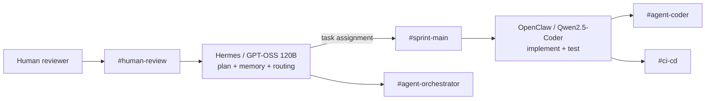

# Forge Title Collector

A submission-ready implementation of the NMG Labs Forge Sprint 02 pre-sprint mini-challenge. Hermes is the planning/orchestration agent; OpenClaw is the coding worker; Slack is the human-visible coordination layer.

## What it does

The CLI fetches the HTML title for one or more URLs, writes a timestamped JSON report, and fails cleanly for invalid URLs or pages that cannot be fetched. It uses only Python's standard library, so it is easy to run under the required time limit.

```bash
python3 -m title_collector https://example.com https://www.python.org https://www.wikipedia.org
```

Results are written to `output/titles.json` by default. Use `--output path.json` to choose another location.

## Agent architecture



Communication stays in Slack: the orchestrator posts the plan and assignments, the coding agent reports structured progress, CI posts verification, and a human approves the final output. `agent-log.md` records the same audit trail for the repository.

## Model routing

| Role | Model | Why |
| --- | --- | --- |
| Hermes planner | `openai/gpt-oss-120b` via Groq | Decomposition, error judgement, and memory |
| OpenClaw worker | `qwen2.5-coder` via Ollama | Fast local implementation and tests |
| Status/formatting | local/cheap model | Low-cost structured reports |

## Quick verification

```bash
python3 -m unittest discover -s tests -v
python3 scripts/health_check.py
```

## Configure the live agent stack

1. Set `GROQ_API_KEY` and configure Hermes with `hermes.config.json`.
2. In OpenClaw, select Ollama and `qwen2.5-coder`; its operating contract is in `openclaw/IDENTITY.md`.
3. Create the five Slack channels listed in `docs/slack-runbook.md`, connect both agents, and use the message script in that file.
4. Capture Slack screenshots/export and a 60–90 second recording. Add them under `evidence/` before submission (this repository deliberately does not fabricate evidence).

## Repository layout

- `title_collector/` — tested Python implementation
- `tests/` — unit tests and failure-path coverage
- `scripts/health_check.py` — automated quality gate
- `.github/workflows/ci.yml` — GitHub Actions quality gate
- `skills/title-collection/SKILL.md` — Hermes skill, automatically selected for collection tasks
- `agent-log.md` — immutable-style agent activity record
- `docs/slack-runbook.md` — live Slack demonstration script and human approval gate

## Submission checklist

- [ ] Run the CLI on three URLs and retain `output/titles.json`.
- [ ] Connect Hermes and OpenClaw to Slack; capture the prescribed chat loop.
- [ ] Demonstrate Hermes memory recall and the `title-collection` skill firing.
- [ ] Run the unit tests and health check; ensure GitHub Actions is green.
- [ ] Add real Slack evidence and screen recording, then push this repository publicly.
